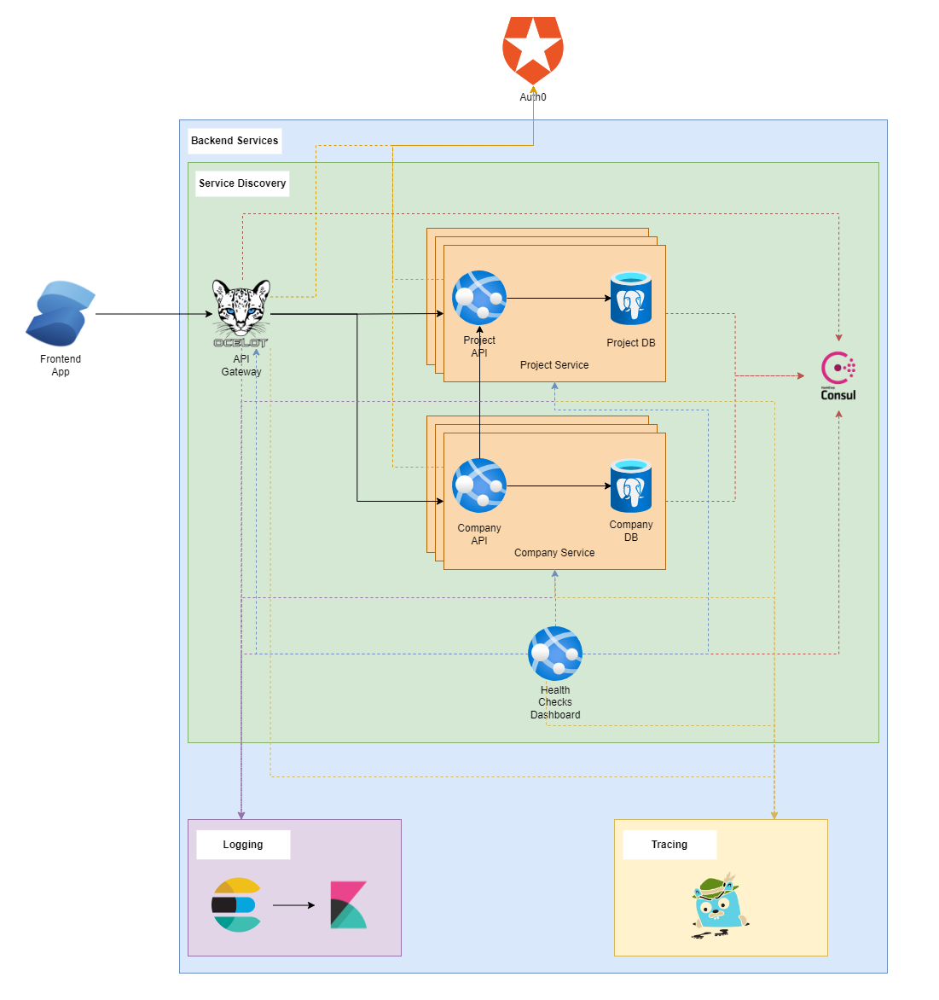

# Nexus Template



## Components
* [API Gateway](api-gateway/README.md)
* [API Services](services/README.md)
* [Service Discovery/Configuration Server](discovery-server/README.md)
* [Health Checks](health-checks-dashboard/README.md)
* [Frontend App](frontend-app/README.md)

## Libraries/Framework
* [Auth](libraries/src/Nexus.Auth/README.md)
* [Configuration](libraries/src/Nexus.Configuration/README.md)
* [Core](libraries/src/Nexus.Core/README.md)
* [Logging](libraries/src/Nexus.Logging/README.md)
* [Management](libraries/src/Nexus.Management/README.md)
* [Persistence](libraries/src/Nexus.Persistence/README.md)
* [Tracing](libraries/src/Nexus.Telemetry/README.md)
* [Framework](libraries/src/Nexus.Framework.Web/README.md)

## Project Scope
Create a simple microservices based application with the following components:

* [x] Service Discovery (Consul)
    * [x] Basic Setup
    * [x] Setup Scripts
    * [x] ACL Setup
    * [ ] ~~mTLS Setup~~
* [x] Configuration Server **(One or more of)**
    * [x] Consul KV
    * [ ] ~~Vault~~
* [x] Api Gateway (Ocelot)
    * [x] Project Setup
    * [x] Connection with Consul
    * [x] Auth Implementation
    * [x] Add routes for company-api
    * [x] Add routes for project-api
    * [x] Consul Policies
    * [x] Consul Configuration
* [x] Logging/Monitoring **(One of)**
    * [ ] ~~Azure Application Insights~~
    * [x] ELK
        * [x] [Create Docker Compose Files](https://www.elastic.co/guide/en/elasticsearch/reference/current/docker.html)
* [x] Tracing
    * [x] Setup Jaeger using Docker
* [x] Authentication/Authorization **(One of)**
    * [ ] ~~Azure AD~~
    * [ ] ~~Keycloak~~
    * [ ] ~~Identity Server~~
    * [x] Auth0
        * [x] Create an API
        * [x] Create Backend Application
        * [x] Create Frontend Application
        * [x] Documentation
* [x] Health checks dashboard
* [x] Backend Apis (.NET 7)
    * [x] Company API
        * [x] Project Setup
        * [x] Logging
        * [x] [Tracing using OpenTelemetry](https://github.com/open-telemetry/opentelemetry-dotnet/blob/main/src/OpenTelemetry.Instrumentation.AspNetCore/README.md)
        * [x] Auth
        * [x] Controllers
        * [x] Health checks
        * [x] Docker file
        * [x] Unit Tests
        * [ ] ~~Integration Tests~~
        * [x] CI/CD
        * [x] Consul Policies
        * [x] Consul Configuration
    * [x] Project Api
        * [x] Project Setup
        * [x] Logging
        * [x] [Tracing using OpenTelemetry](https://github.com/open-telemetry/opentelemetry-dotnet/blob/main/src/OpenTelemetry.Instrumentation.AspNetCore/README.md)
        * [x] Auth
        * [x] Controllers
        * [x] Health checks
        * [x] Docker file
        * [x] Unit Tests
        * [ ] ~~Integration Tests~~
        * [x] CI/CD
        * [x] Consul Policies
        * [x] Consul Configuration
* [x] Frontend Application
    * [x] SolidJS App
    * [x] Integration with Auth0
    * [x] Tests
    * [x] CI/CD
* [ ] Create Deployment Files for K8s
    * [ ] [ELK](https://phoenixnap.com/kb/elasticsearch-kubernetes)
* [ ] Misc
    * [x] Finalize Project Scope
      * [x] Task Assignment
      * [x] Trainings
          * [x] Docker
      * [x] Development
      * [ ] Documentation
      * [x] Component Integration
      * [ ] Presentation / Demo
      * [x] Move ACL for each microservice to its own service directory
      * [ ] 
        ~~[Use certificates generated by Elastic to validate serilog connection](https://www.elastic.co/guide/en/elasticsearch/client/net-api/2.x/working-with-certificates.html)~~


## Getting Started

Before you can begin development, you need to setup the following:

* Auth0
* Consul
* Docker
* DotNET 7 SDK

### Auth0

#### Create Backend Application

* Under Applications > Applications, create a new application with the following settings:
    * Name: `Project Management Backend`
    * Application Type: Regular Web Application
    * Allowed Callback URLs: `http://localhost:8012/login/oauth2/code/auth0`
    * Grant Types: Authorization Code, Refresh Token, Implicit, Client Credentials

#### Create a Frontend Application

* Under Applications > Applications, create a new application with the following settings:
    * Name: `Project Management Frontend`
    * Application Type: Single Page Application
    * Allowed Callback URLs: `http://localhost:3000`
    * Allowed Logout URLs: `http://localhost:3000`
    * Grant Types: Authorization Code, Refresh Token, Implicit

#### Create an API

* Under Applications > APIs, create a new API with the following settings:
    * Name: `Project Management`
    * Identifier: `projectmanagement`
    * Signing Algorithm: `RS256`
* Under Permissions tab of the API, create the following permissions:
    * `read:company`
    * `write:company`
    * `read:project`
    * `write:project`
    * `read:project`
    * `write:project`
    * `update:project`
    * `delete:project`
* Under the Machine to Machine Applications tab, Authorize the Backend Application created above to access the API and
  assign the permissions created above.

### Consul
Refer to documentation for [Discovery Server](discovery-server/README.md)

### Known Issues
#### docker-compose fails to start es01

Run the following script:
```powershell
wsl -d docker-desktop sysctl -w vm.max_map_count=262144
```
